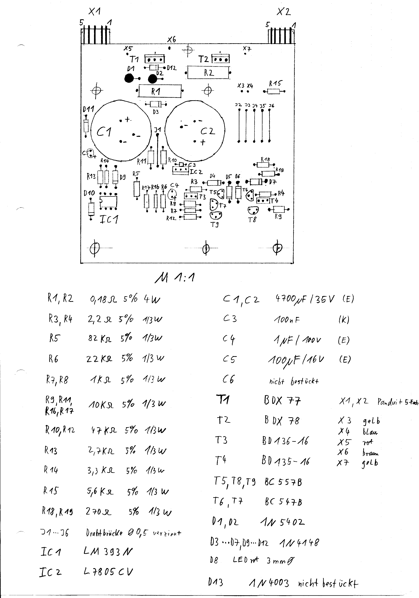
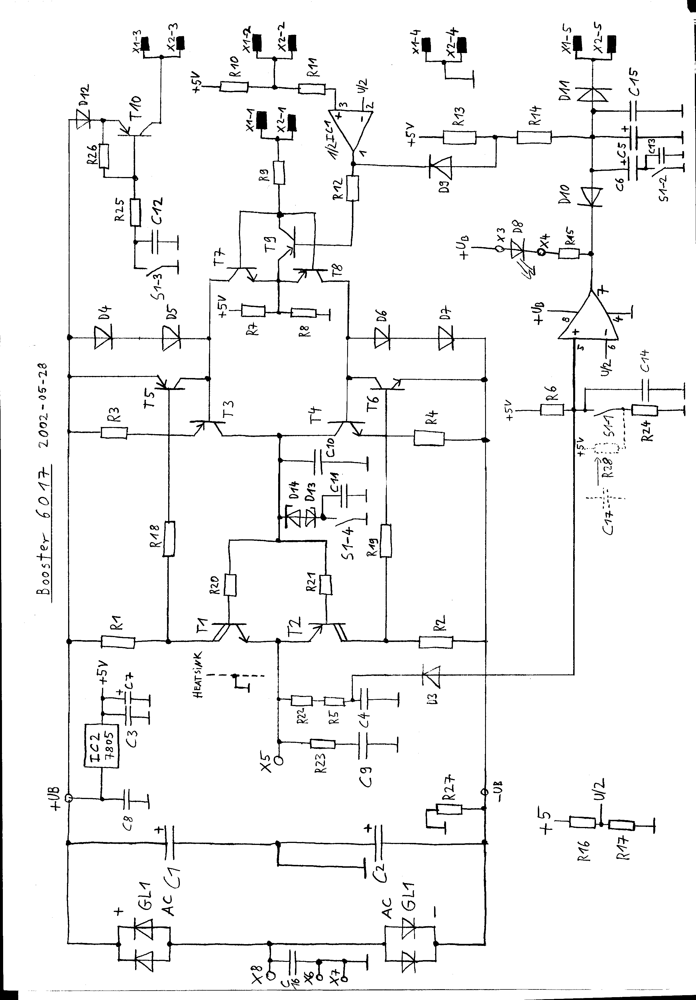
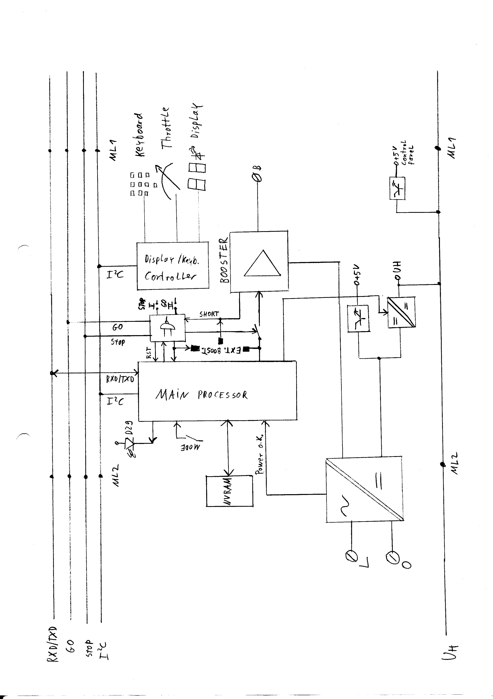
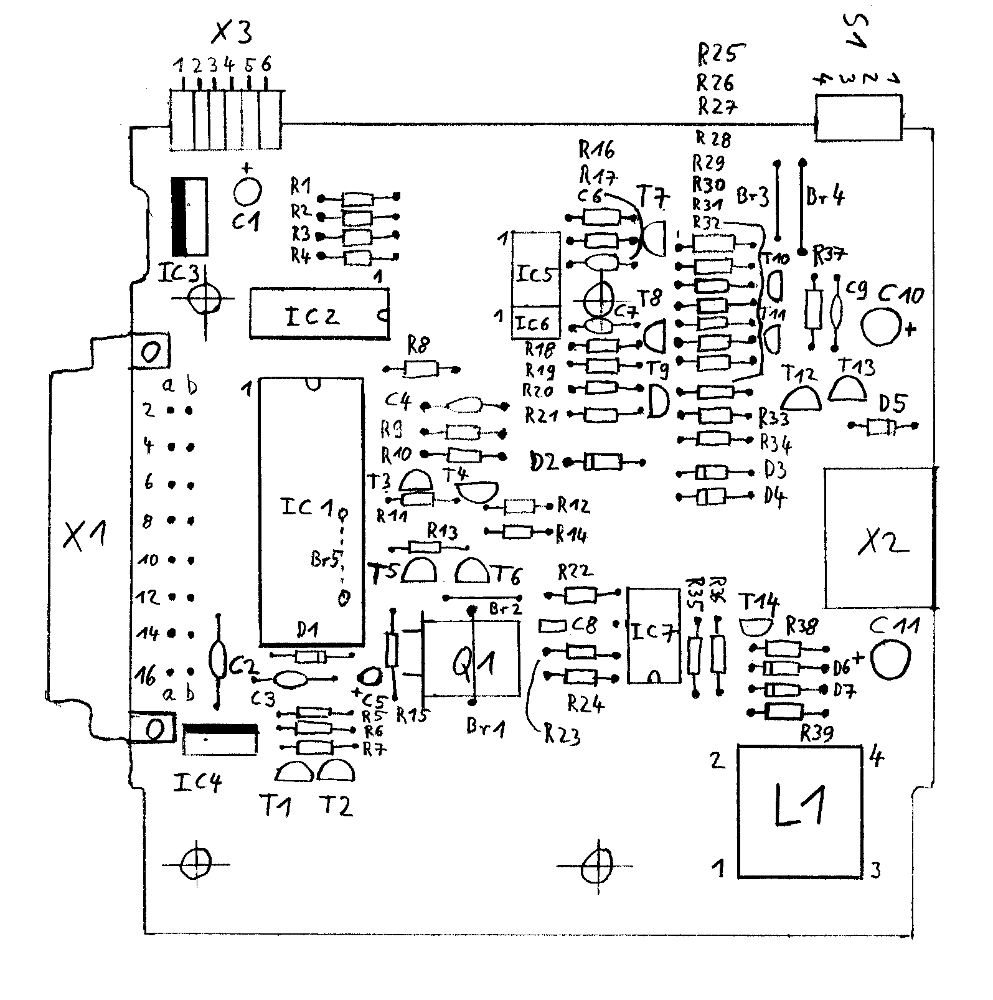

# Geräteübersicht Märklin Digital (60xx Serie)

Diese Übersicht listet die wichtigsten Komponenten des klassischen Märklin Digital-Systems auf.

## Zentral- und Steuergeräte
Diese Geräte koordinieren die Kommunikation auf dem I2C-Bus, verstärken Signale oder dienen der manuellen Steuerung.

| Typ | Name | Beschreibung | Bild |
| :--- | :--- | :--- | :--- |
| **6001** | Transformator | Transformator (42 VA) zur Stromversorgung der Control Unit oder von Boostern. | |
| **6002** | Transformator | Transformator (52 VA) zur Stromversorgung der Control Unit oder von Boostern. | |
| **6015** | Booster | Leistungsteil zur Verstärkung des Gleissignals für einen eigenen Versorgungsabschnitt. |  |
| **6017** | Booster | Weiterentwickelter Booster zur Verstärkung des Gleissignals. |  |
| **6020** | Zentraleinheit (Central Unit) | Die erste Zentrale des Systems. Sie koordiniert die Kommunikation auf dem Bus und generiert das Gleissignal (MM1). | |
| **6021** | Control Unit | Weiterentwicklung der Zentrale mit integriertem Fahrpult. Unterstützt das MM2-Protokoll und dient als Master für das System. |  |
| **6035** | Control 80 | Externes Fahrpult zur Steuerung von Lokomotiven (Adressen 01-80). Anschluss erfolgt auf der rechten Systemseite. | |
| **6036** | Control 80f | Erweitertes Fahrpult mit Tasten für die Sonderfunktionen f1-f4 und Anzeige der Fahrtrichtung. | |
| **6040** | Keyboard | Stellpult für bis zu 16 Magnetartikel (Weichen, Signale). Wird auf der linken Systemseite angeschlossen. | |
| **6043** | Memory | Fahrstraßenspeicher, der bis zu 24 Schaltfolgen speichern und auf Knopfdruck abrufen kann. | |
| **6050/6051** | Interface | Computer-Schnittstelle (RS-232), die die Steuerung der Anlage durch einen PC ermöglicht. |  |
| **6070** | Infra Control 80f | Infrarot-Steuergerät zur kabellosen Bedienung von Lokomotiven über Infrarot-Handsender. | |
| **60128** | Connect 6021 | Adapter zum Anschluss der Control Unit 6021 an die Central Station 2/3. Ermöglicht die Weiternutzung alter Fahrpulte. | |

## Dekoder
Diese Bausteine empfangen das Motorola-Protokoll vom Gleis und setzen es in Aktionen (Fahren, Schalten) um.

| Typ | Name | Beschreibung | Bild |
| :--- | :--- | :--- | :--- |
| **6073** | Weichendekoder | Spezialdekoder zum direkten Einbau in Weichengehäuse. | |
| **6080** | Digital-Dekoder c80 | Standard-Lokdekoder der ersten Generation (Motorola MM1). | |
| **6083** | Empfänger k83 | Schaltdekoder für bis zu 4 Magnetartikel (z.B. Weichenantriebe oder Signale). | |
| **6084** | Empfänger k84 | Schaltdekoder für 4 Dauerstrom-Verbraucher (z.B. Beleuchtung). | |
| **6090** | Hochleistungs-Dekoder | Lokdekoder mit Lastregelung für geregelte Motoren. | |
