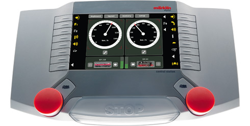

Kommunikationsprotokoll
Graphical User Interface Prozessor (GUI)
<->
Gleisformat Prozessor (Gleis Format Prozessor)
über CAN
Transportierbar über Ethernet
(Version vom 7.2.2012)
Gebr. Märklin & Cie. GmbH, Göppingen
Copyright (C) 2012 Gebr. Märklin & Cie. GmbH

Inhaltsverzeichnis:
1! 5!
CAN Anschluss ...........................................................................................................................................
1.1! 5!
CAN Grundformat ........................................................................................................................
1.2! 5!
Feldergrundbeschreibung ............................................................................................................
1.2.1! 5!
Priorität (Prio) .........................................................................................................................
1.2.2! 5!
Kommando .............................................................................................................................
1.2.3! 6!
Response ...............................................................................................................................
1.2.4! 6!
Hash .......................................................................................................................................
1.2.5! 6!
Meldungsbestätigung .............................................................................................................
1.2.6! 6!
Sonstiges ...............................................................................................................................
1.2.7! 7!
Übertragung der CAN Kommandos via Ethernet ...................................................................
1.3! 8!
Allgemeines .................................................................................................................................
1.3.1! 8!
Adressen im System – Die UID .............................................................................................
1.3.1.1! 8!
Definition der Teilnehmerkennungen .......................................................................................
1.3.1.2! 8!
Einbindung bestehender Gleisprotokolle, Bildung der „Loc-ID“ ...............................................
1.3.2! 9!
Bildung von Automatik-UID und Rückmelde-UID ..................................................................
1.3.2.1! 9!
Gerätekennungen .....................................................................................................................
1.3.2.2! 9!
Rückmeldekennungen und Automatikkennungen ....................................................................
1.3.2.3! 10!
Automatisierungsadressen / Rückmeldeadressen .................................................................
1.3.3! 10!
Fahrstufen im System ..........................................................................................................
1.4! 11!
Übersicht Werte der Kommandos ..............................................................................................
2! 12!
System-Befehle .........................................................................................................................................
2.1! 12!
Befehl: System Stopp ................................................................................................................
2.2! 13!
Befehl: System Go .....................................................................................................................
2.3! 14!
Befehl: System Halt ...................................................................................................................
2.4! 15!
Befehl: Lok Nothalt .....................................................................................................................
2.5! 16!
Befehl: Lok Zyklus beenden .......................................................................................................
2.6! 17!
Befehl: Lok Datenprotokoll .........................................................................................................
2.7! 18!
Befehl: Schaltzeit Zubehördecoder festlegen ............................................................................
2.8! 19!
Befehl: Fast Read für mfx SID - Adresse ...................................................................................
2.9! 20!
Befehl: Gleisprotokoll Frei Schalten ...........................................................................................
2.10! 21!
Befehl: System MFX Neuanmeldezähler setzen .......................................................................
2.11! 22!
Befehl: System Überlast ............................................................................................................
2.12! 23!
Befehl: System Status ...............................................................................................................
2.13! 24!
Befehl: Gerätekennung .............................................................................................................
2.14! 25!
Befehl: System Reset ................................................................................................................
3! 26!
Verwaltung ................................................................................................................................................
3.1! 26!
Befehl: Lok Discovery ................................................................................................................
3.2! 28!
Befehl: MFX Bind .......................................................................................................................
3.3! 29!
Befehl: MFX Verify .....................................................................................................................
3.4! 30!
Befehl: Lok Geschwindigkeit ......................................................................................................
3.5! 31!
Befehl: Lok Richtung ..................................................................................................................
3.6! 32!
Befehl: Lok Funktion ..................................................................................................................
3.7! 33!
Befehl: Read Config ...................................................................................................................
3.8! 35!
Befehl: Write Config ...................................................................................................................
4! 37!
Zubehör-Befehle ........................................................................................................................................
4.1! 37!
Befehl: Zubehör Schalten ..........................................................................................................
5! 38!
Rückmeldungen ........................................................................................................................................
5.1! 39!
Befehl: S88 Polling .....................................................................................................................
5.2! 40!
Befehl: Rückmelde Event ...........................................................................................................
6! 41!
Sonstige Befehle .......................................................................................................................................
6.1! 41!
Befehl: Softwarestand Anfrage / Teilnehmer Ping .....................................................................
6.2! 42!
Befehl: Statusdaten Konfiguration .............................................................................................
7! 46!
GUI Informationsübertragung ....................................................................................................................
7.1! 46!
Befehl: Anfordern Config Data ...................................................................................................
7.2! 48!
Befehl: Config Data Stream .......................................................................................................
8! 50!
Format der Konfigurationsdateien der CS2 ...............................................................................................
8.1! 50!
Konfigurationsdatei "Lokomotive.cs2" ........................................................................................
8.1.1! 50!
Sektion "version" ..................................................................................................................
8.1.2! 50!
Sektion "session" .................................................................................................................
8.1.3! 51!
Sektion "lokomotive" ............................................................................................................
8.1.3.1! 51!
2. Ebene Sektion ".funktionen" ...............................................................................................
8.1.3.2! 51!
2. Ebene Sektion ".prg" ..........................................................................................................
8.2! 53!
Konfigurationsdatei "magnetartikel.cs2" ....................................................................................
8.2.1! 53!
Sektion "version" ..................................................................................................................
8.2.2! 53!
Sektion "artikel" ....................................................................................................................
55!
Konfigurationsdatei "fahrstrasse.cs2" ..................................................................................................
8.2.3! 55!
Sektion "version" ..................................................................................................................
8.2.4! 55!
Sektion "fahrstrasse" ............................................................................................................
8.2.4.1! 55!
2. Ebene Sektion ".item" .........................................................................................................
8.3! 57!
Konfigurationsdatei "gleisbild.cs2" .............................................................................................
8.3.1! 57!
Sektion "version" ..................................................................................................................
8.3.2! 57!
Sektion "groesse" .................................................................................................................
8.3.3! 57!
Sektion "zuletztBenutzt" .......................................................................................................
8.3.4! 57!
Sektion "seite" ......................................................................................................................
8.3.5! 58!
Sektion "element" .................................................................................................................
8.4! 60!
Konfigurationsstream "lokinfo" ...................................................................................................
8.5! 62!
Konfigurationsstream "loknamen" ..............................................................................................
8.6! 63!
Konfigurationsstream "maginfo" .................................................................................................
8.7! 64!
Konfigurationsstream "lokdb" .....................................................................................................
8.8! 65!
Konfigurationsstream "ldbver" ....................................................................................................
9! 66!
Automatisierung ........................................................................................................................................
9.1! 66!
Befehl: Automatik schalten ........................................................................................................
10! 68!
Abkürzungen ............................................................................................................................................
Haftungsausschluss:
Die in diesem Doument enthaltenen Informationen beschreibt die Kommunikations-
systematik der Komponenten von Märklin Digital.
Diese Dokumentation wird "wie sie ist" und ohne jede Gewährleistung für Funktion,
Korrektheit oder Fehlerfreiheit zur Verfügung gestellt. Für jedweden direkten oder
indirekten Schaden - insbesondere Schaden an anderer Software, Schaden an
Hardware, Schaden durch Nutzungsausfall und Schaden durch Funktions-
untüchtigkeit der damit verbundenen Produkte, kann der Autor nicht haftbar
gemacht werden.
Diese Beschreibung wurde mit größter Sorgfalt entwickelt, jedoch können Fehler
niemals ausgeschlossen werden. Es kann daher keine Gewähr für die Richtigkeit
übernommen werden.
Dies Beschreibung stellt keine Zusicherung von Eigenschaften des Märklin Digital
Systems oder den damit verbundenen Produkten dar.
Technische Änderungen sind vorbehalten.
Urheberrecht
Die folgenden Seiten unterliegen dem deutschen Urheberrecht. Die Vervielfältigung,
Bearbeitung, Verbreitung und jede Art der Verwertung außerhalb der Grenzen des
Urheberrechtes bedürfen der schriftlichen Zustimmung der Fa. Gebr. Märklin & Cie
GmbH.