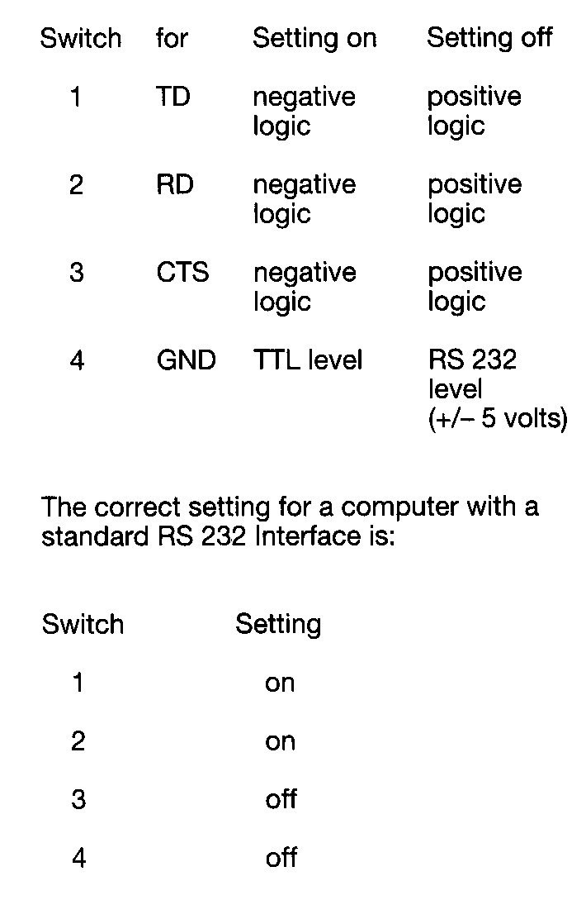
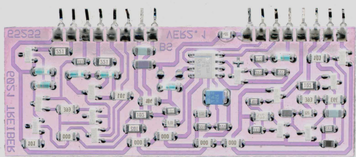

# Märklin Digital Patents and Design Protection

This directory contains information about patents, utility models (Gebrauchsmuster), and design protection related to the Märklin Digital system.

## DE 84 27 671 U1 - Gehäusekopplung

- **Type:** Gebrauchsmuster (Utility Model)
- **Number:** DE 84 27 671 U1
- **File Number:** M 84 02 858.7 (or M 84 02 858)
- **Description:** Mechanism for coupling device housings. This refers to the physical interlocking mechanism of the Märklin Digital 60xx series (Central Unit, Control 80, Keyboard, Memory, etc.), where devices are plugged together side-by-side to form a continuous bus and physical unit via DIN 41612 B/2 connectors.

### Visual Evidence: Housing Coupling
The following image shows the side-mounted connectors (Messerleiste/Federleiste) used for physical and electrical coupling:

*Example from the 6050 Interface documentation showing the coupling interface.*

## Design Protection (Geschmacksmuster / Designschutz)

- **Class:** 21-03 / 14-03
- **Scope:** Single elements and overall aesthetic design of the Märklin Digital 60xx series.
- **Key Features:**
    - **Color Scheme:** The specific "Märklin-Grau" (Märklin Grey) housing color combined with red accent keys.
    - **Keyboard Layouts:** Specific layouts of the membrane keyboards (Folientastaturen), such as the turnout grid (Weichenraster) on the Keyboard 6040.

### Visual Evidence: Color Scheme and Accent Buttons
The Central Unit 6021 exemplifies the classic design language:

*Märklin 6021 showing the grey housing and characteristic red 'Stop' and 'Go' buttons.*

### Visual Evidence: Keyboard 6040 Turnout Grid
The specific layout of the turnout control grid was a protected design element:

*Documentation snippet showing the Keyboard 6040 turnout grid.*
