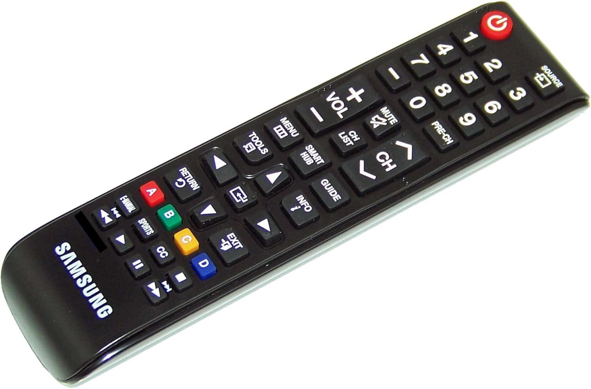

# Samsung Remote Control BN59-01199F IR Protocol

This document describes the Infrared (IR) protocol used by the Samsung BN59-01199F remote control.



## Protocol Specification

- **Carrier Frequency:** 38 kHz
- **Modulation:** Pulse Distance Encoding
- **Bit Length:** 32 bits (typically 16-bit Address + 16-bit Command)
- **Endianness:** LSB first (Least Significant Bit)

### Timings

| Pulse Type | Mark (µs) | Space (µs) | Total (µs) |
| :--- | :--- | :--- | :--- |
| **Header** | 4500 | 4500 | 9000 |
| **Logic 0** | 560 | 560 | 1120 |
| **Logic 1** | 560 | 1690 | 2250 |

## Hardware Connection

To read the IR signal with an Arduino, you can use a dedicated IR receiver IC (like the TSOP38238) or a simple phototransistor.

### Using a Phototransistor (Simple Setup)
1. Connect the **Collector** of the phototransistor to **5V**.
2. Connect the **Emitter** to a **10kΩ resistor** and **Arduino Digital Pin 2**.
3. Connect the other end of the **resistor** to **GND**.

*Note: For better reliability, a dedicated IR receiver IC is recommended as it includes an internal band-pass filter for the 38kHz carrier.*

## Minimal Arduino Sketch

The following sketch uses the `pulseIn()` function to measure the timing of the incoming signal and decode the 32-bit data frame.

```cpp
/*
 * Minimal Arduino sketch to decode Samsung 32-bit IR signals.
 * Pin: Digital 2 (connected to IR receiver signal output)
 */

const int IR_PIN = 2;
const unsigned long HEADER_MIN = 4000;
const unsigned long HEADER_MAX = 5000;
const unsigned long BIT_THRESHOLD = 1000; // 560us for 0, 1690us for 1

void setup() {
  Serial.begin(115200);
  pinMode(IR_PIN, INPUT);
  Serial.println("Ready to receive Samsung IR signals...");
}

void loop() {
  // Wait for the header space (approx 4.5ms)
  // Note: pulseIn measures the duration of a HIGH or LOW pulse.
  // Standard IR receivers are active-low, so we measure the HIGH space.
  unsigned long duration = pulseIn(IR_PIN, HIGH);

  if (duration > HEADER_MIN && duration < HEADER_MAX) {
    uint32_t decodedData = 0;

    for (int i = 0; i < 32; i++) {
      // Measure the space duration following the constant 560us mark
      unsigned long bitSpace = pulseIn(IR_PIN, HIGH);

      if (bitSpace > BIT_THRESHOLD) {
        // Logic 1 (1.69ms)
        decodedData |= (1UL << i);
      }
      // Logic 0 (560us) is implicit if the bitSpace is less than threshold
    }

    Serial.print("Received Hex: 0x");
    Serial.println(decodedData, HEX);
    delay(500); // Simple debounce/delay between presses
  }
}
```
